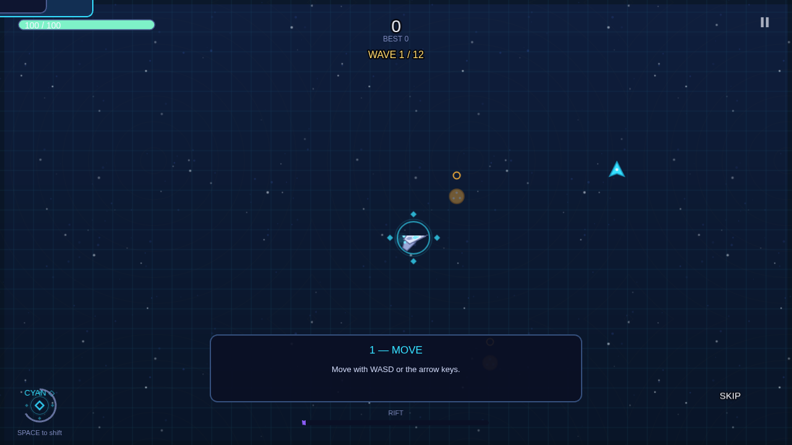

# ECHOFLUX: RIFTBREAK ARENA

A futuristic top-down action roguelite for the browser. Pilot a rift-craft
through two overlapping realities — **Cyan ◇** and **Amber ○** — outfight
escalating waves, draft augments, and break three bosses to close the Rift.

Built with **Phaser 4 + Vite**. All artwork and audio are generated
procedurally at runtime — zero image or sound assets, no external requests,
fully static deployable.



## Quick start

```bash
npm install      # install dependencies
npm run dev      # dev server at http://localhost:8080
```

| Command | Description |
|---|---|
| `npm run dev` | Vite dev server (port 8080) |
| `npm run build` | Production build into `dist/` |
| `npm run preview` | Serve the production build locally |
| `npm test` | Unit test suite (pure gameplay logic — 70 tests) |
| `npm run test:e2e` | Headless-browser smoke suite against `dist/` (build first) |

## Controls

**Desktop**

| Action | Input |
|---|---|
| Move | WASD or arrow keys |
| Shift reality | SPACE or right-click |
| Pause | ESC or P |
| Confirm focused button | ENTER |

**Touch (phones and tablets — auto-detected, no user-agent sniffing)**

| Action | Input |
|---|---|
| Move | Virtual joystick — drag anywhere on the left half |
| Shift reality | Large ◇/○ button, bottom right |
| Pause | Button, top right |

## How to play

- Enemies, projectiles, hazards, and energy motes each belong to **one
  reality**. You can only damage — and be damaged by — what shares **your**
  reality. Out-of-phase enemies appear ghosted with a phase marker above them.
- **Shift reality** to dodge in the safe dimension or to strike in theirs.
  Switching is instant but has a short cooldown.
- **Destabilization**: ignore an enemy too long and it destabilizes — it
  pulses white and fires *phase-piercing* volleys that hit both realities.
  Camping in the safe reality is not a strategy.
- **Flux motes** drop from defeated enemies in their reality; collect in-phase
  to charge the **RIFT meter**. Full meter triggers **Overdrive** (double fire
  rate, +25% damage).
- Auto-fire targets the nearest enemy sharing your reality — positioning and
  phase choice are the whole game.
- Phases are readable without color: angular silhouettes + ◇ markers + grid
  patterns are Cyan; rounded silhouettes + ○ markers + ring patterns are Amber.

## Content

- **Campaign**: 12 authored waves across 3 arenas, ending with three boss
  encounters — **HELIX PRISM** (wave 4), **MAGMA CHOIR** (wave 8),
  **THE RIFTKEEPER** (wave 12). Bosses telegraph attacks, flip their
  vulnerability phase on a timer, and enrage below 30% HP.
- **24 upgrades** across six categories (offense, mobility, defense, economy,
  phase, utility), offered between waves with validated stacking rules.
- **Endless mode**: unlock-free, from the main menu, and continues after the
  campaign victory. Scaling enemy budgets, elite chance ramps to 25%, and a
  cycling boss every 4 sectors with growing HP.
- **7 enemy archetypes** with distinct behaviors (pursuit, telegraphed dash
  charges, ranged kiting, orbiting spirals, frontal-shield tanks, splitters,
  healers) plus **elite variants** with homing volleys.

## Settings & saving

Settings (music/sfx volume, reduced motion), best score, and best waves are
stored in `localStorage` under `echoflux.save.v1` with full validation —
corrupt, blocked, or unavailable storage falls back to safe defaults and the
game stays playable (incognito-safe). Progression is **local only**; nothing is
synced or uploaded.

## Poki integration

The official Poki SDK (v2) is integrated per
[developers.poki.com](https://developers.poki.com):

- SDK script tag in `index.html`; safe init with documented fallback when
  unavailable.
- `gameLoadingFinished()` fires once the menu is interactive.
- `gameplayStart()` on the first actual gameplay input; `gameplayStop()` on
  pause, wave end, death, victory, quit, and boss intros — no duplicate or
  consecutive events, and all gameplay events are blocked during ad breaks.
- `commercialBreak()` at natural restarts (resume, next wave, restart),
  audio and input muted during breaks, restored after.
- Optional **Second Chance** revive via `rewardedBreak()` on the death
  screen — standard END RUN button is equal-sized and adjacent, per Poki's
  hierarchy rules; rewards are only granted on genuine SDK success.

See `docs/POKI_CHECKLIST.md` for the submission checklist and
`src/game/systems/PokiAdapter.js` for the integration (unit-tested state
machine in `tests/poki.test.js`).

## Project structure

```
src/main.js                    bootstrap (context + game)
src/game/main.js               Phaser config (1280x720, Scale.FIT)
src/game/scenes/               Boot, Preloader, MainMenu, Game
src/game/core/                 Balance, PhaseRules, CombatRules, RunState,
                               Waves, Palette, EventBus, Context
src/game/systems/              Upgrades, ScoreSystem, SaveSystem,
                               PokiAdapter, AudioSystem, InputSystem,
                               WaveDirector
src/game/entities/             Player, Enemy, Boss, Pickup (motes), Hazard
src/game/gfx/                  TextureFactory (procedural art), ArenaBackground, Fx
src/game/ui/                   HUD, UpgradeUI, PauseUI, SettingsUI,
                               TutorialUI, EndRunUI, UI kit
tests/                         unit tests (node --test, no dependencies)
e2e/smoke.mjs                  headless-browser smoke suite (playwright-core)
docs/                          notices, checklists, QA report
```

Architecture notes: gameplay rules live in framework-free modules under
`src/game/core` and `src/game/systems` (unit-testable in Node); Phaser-coupled
code stays in scenes/entities/UI. One authoritative run state per session, an
explicit UI state machine, manual object pools, delta-time-driven movement,
and a single update accumulator that freezes with the game (no gameplay
timers survive a pause).

## Deployment

The production build is a fully static site:

```bash
npm run build
# upload the contents of dist/ to any static host
```

No backend, no database, no runtime services. `dist/` contains `index.html`,
hashed JS, CSS, and the favicon — nothing else.

## Testing

- `npm test` — 70 unit tests covering the phase damage matrix,
  destabilization timing, combat resolution (i-frames, shield, second wind,
  idempotent death rewards), upgrade definitions/validation/stacking, wave
  table integrity + endless scaling, save corruption/quota/incognito
  behavior, scoring bounds, and the Poki event state machine.
- `npm run test:e2e` — boots the production build in headless Chrome and
  walks the real flows: menu → campaign → movement/phase-switch → pause/
  resume → wave clear → upgrade draft → death → results → restart → boss
  intro → boss kill → victory → endless continue, plus a mobile emulation
  session with touch joystick and phase-button taps. Fails on any console
  error or page error. Screenshots land in `e2e/screenshots/`.

## License & credits

- This repository's game code is original work, distributed under the MIT
  license (see `LICENSE`).
- Built on **Phaser 4** (MIT, © Phaser Studio Inc) — see
    `docs/THIRD_PARTY_NOTICES.md`.
- The Poki SDK script is loaded from Poki's CDN and governed by the Poki for
  Developers terms.
- All artwork, typography, and audio in this game are generated
  procedurally by this project's own code. No third-party assets are bundled.
